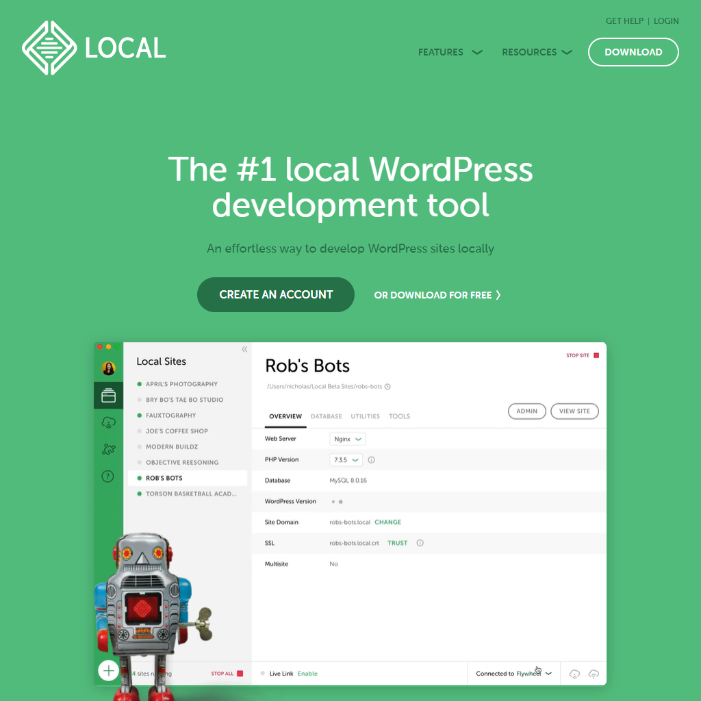
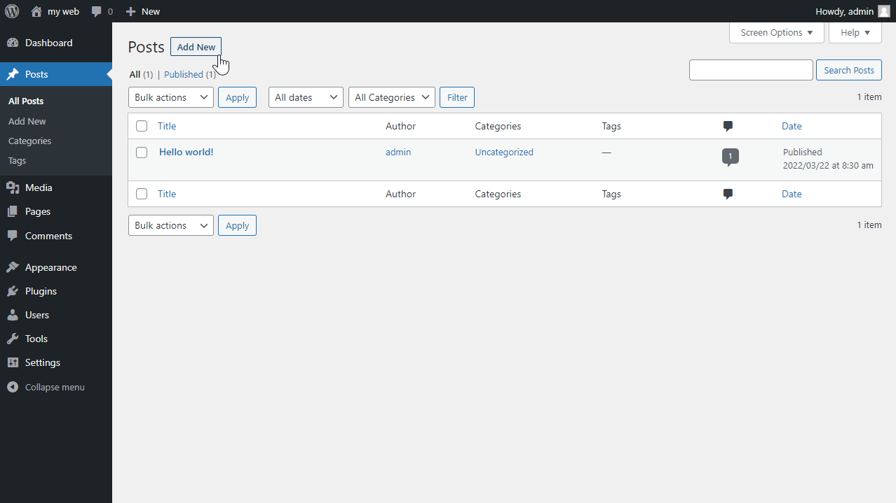
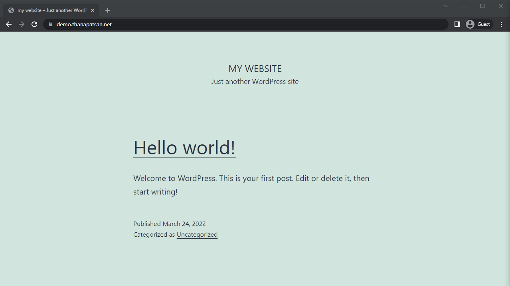

ไม่นานมานี้ผมได้รับข้อความจากอาจารย์มหาลัยให้ไปเป็นแขกรับเชิญเข้าไปสอนคลาสเรียนคลาสนึง ไหนๆช่วงนี้ก็กำลังทุบเว็บทำใหม่พอดีก็เลยเอาเนื้อหานี้แหละไปสอน

---

## Part 1: WordPress คืออะไร
WordPress คือชุดโปรแกรมสำหรับจัดการเนิ้อหา (CMS: Content Management System) ยอดนิยมอันดับต้นๆของโลก ซึ่งปกติแล้วตัว WordPress นั้นมักจะถูกนำมาใช้ทำเว็บไซต์ต่างๆหลากหลายประเภท ตั้งแต่เว็บบล็อกเขียนบทความ เว็บขายของเล็กๆ เว็บพอร์ตโฟลิโอ และอื่นๆ อีกมากมาย

### ทำไมคนใช้เยอะล่ะ
**นำมาใช้ได้ฟรี**  
เพราะ WordPress นั้นเป็นซอฟท์แวร์เปิด (Open source) ที่อนุญาติให้ทุกคนสามารถโหลดไปใช้ได้แบบไม่มีค่าใช้จ่ายใดๆเลยจากเว็บทางการที่ [wordpress.org](http://wordpress.org/)

**มีสังคมผู้พัฒนาขนาดใหญ่**  
ต่อจากข้อข้างบน ด้วยความที่เป็นซอฟท์แวร์เปิด (Open source) ทำให้ผู้พัฒนาเว็บสามารถเข้าถึงโค้ดต้นฉบับได้ตลอด ทำให้การเขียนโปรแกรมต่อยอดขึ้นมานั้นง่ายมาก

**ใช้งานง่าย**  
อีกจุดเด่นของ WordPress คือระบบการจัดการเนื้อหาที่ใช้งานง่าย หน้าตาคล้ายคลึงกับโปรแกรมเขียนเอกสารทั่วไป และยังเป็นระบบออนไลน์ ขอแค่มีเพียงคอมพิวเตอร์ที่มีเน็ต ก็สามารถเข้าไปเขียนหรือแก้ไขเนื้อหาได้ตลอดเวลา

**ดีไซน์หน้าเว็บหลากหลาย**  
ในปัจจุบันนี้ตัว WordPress เองนั้นมีธีมเว็บให้ผู้ใช้สามารถเลือกใช้ได้หลากหลายดีไซน์ ทั้งแบบฟรีและเสียเงิน และยังสามารถแก้ไขเพิ่มเติมได้เองขึ้นกับความต้องการของแต่ละคน

**เอามาทำอะไรได้บ้าง**  
แม้ว่าตอนแรกนั้นตัว WordPress ถูกออกแบบมาสำหรับการทำเว็บประเภทบทความหรือบล็อก แต่ในปัจจุบันนั้นก็มีคนเขียนต่อยอดเพิ่มความสามารถขึ้นมาให้สามารถทำระบบซื้อขายสินค้าออนไลน์ขนาดย่อมๆขึ้นมา ซึ่งเป็นอีกทางเลือกสำหรับพ่อค้าแม่ค้าออนไลน์ที่อยากตั้งหน้าร้านออนไลน์เองโดยไม่ต้องพึ่งเว็บอื่น หรือแม้กระทั่งระบบเว็บบอร์ดถามตอบที่ให้หลายๆคนเข้ามาใช้งานได้ แต่ยังไงก็ตาม ตัว WordPress เองก็ยังเหมาะกับการทำเว็บประเภทบทความมากกว่าอยู่ดี

**ใครใช้บ้าง**  
กลุ่มผู้ใช้ WordPress ส่วนใหญ่นั้นก็เป็นเว็บที่ให้เนื้อหาเป็นจำนวณมาก เช่นเว็บข่าว เว็บการเรียนการสอน เว็บแสดงผลงาน เว็บแสดงสินค้า เว็บบริษัท และเว็บบล็อกทั่วไป รวมถึงเว็บนี้ด้วย

ถ้าคุณอยากรู้ว่าเว็บไหนใช้เทคอะไรในการทำเว็บบ้าง สามารถใช้พวก scanner มาส่องดูได้ เช่น Wappalyzer หรือ Whatruns

สำหรับใครที่ลองค้นเว็บดูแล้วนั้น อาจจะเจอว่ามี WordPress อยู่สองตัว สองชื่อ ระหว่าง wordpress.com กับ wordpress.org จริงๆแล้วทั้งสองตัวก็คือระบบ WordPress เหมือนกัน แต่จะมีข้อสังเกตดังนี้

[**wordpress.com**](http://wordpress.com/) นั้นจะเป็นผู้ให้บริการเว็บบล็อก สไตล์เดียวกันกับ Medium หรือ Blogger เป็นลักษณะเข้าไปยืมพื้นที่เว็บเขามาใช้ฟรี(หรือจ่ายเพิ่มได้) มีทีมงานดูแลให้ สามารถเขียนเนื้อหาได้ตามปกติ แต่การปรับแต่งต่างๆจะมีข้อจำกัดมากกว่า

[**wordpress.org**](http://wordpress.org/) นั้นจะให้ในส่วนของตัวชุดโปรแกรมให้เรามาติดตั้งเอง ดูแลเอง แต่เราสามารถปรับแต่งส่วนต่างๆได้ทั้งหมด ซึ่งเป็นที่นิยมใช้กันมากกว่า และเป็นจุดโฟกัสของบทความนี้ด้วย

## Part 2: ลองเล่นบนเครื่องตัวเอง
สำหรับพาร์ทนี้นั้นเราจะมาลองเล่น wp บนเครื่องคอมของตัวเองแบบฟรีๆกัน

จริงๆแล้วนั้น WordPress นั้นเนี่ยต้องการโปรแกรมอื่นๆมาเป็นโครงให้มันอีกที โดยส่วนประกอบหลักนั้นก็คือ PHP 7.4 ขึ้นไป และ MySQL 5.6 หรือ MariaDB 10 ขึ้นไป รวมถึง Apache หรือ Nginx มาเป็นตัวเซิร์ฟเวอร์ให้กับตัว wp

โชคดีที่ว่าตอนนี้เรามีโปรแกรมที่ช่วยอำนวยความสะดวกให้เราในการลองใช้ wp โดยช่วยจัดการชุดข้างบนให้เราเสร็จสรรพ ชื่อว่า [LocalWP](https://localwp.com/)

### LocalWP

หน้าตาเว็บของ LocalWP ในปัจจุบัน
เริ่มต้นด้วยการเข้าไปที่เว็บ [localwp.com/releases](https://localwp.com/releases/) เพื่อโหลดตัวโปรแกรมมาลงเครื่องของเรา โดยตัวโปรแกรมนี้เองเนี่ยสามารถใช้งานได้ฟรี แต่แอบมีขายของในเครือนิดนึง ซึ่งเราสามารถกดข้ามได้

[ไปที่หน้า download LocalWP](https://localwp.com/releases/)

---

พอติดตั้งเสร็จแล้วนั้นก็จะพบกับหน้าต่างขาวๆ ที่เชิญให้เรากดปุ่มสร้างเว็บ

ก็จะมีหน้าขึ้นมาให้เราใส่ชื่อเว็บ

ขั้นตอนนี้ก็เป็นการเลือกชุดโปรแกรมเบื้องหลัง ซึ่งในสเต็ปนี้ก็ควรเลือกอันที่แนะนำมา

สเต็ปนี้ก็คือการตั้งบัญชี admin เพื่อเข้าไปใช้งานตัวเว็บ WordPress ของเรา สเต็ปนี้สำคัญมากเพราะถ้าลืมรหัส เราก็จะเข้าใช้งานไม่ได้

เมื่อกด Add site ไปแล้วนั้น ตัวโปรแกรมก็จะตั้งค่าอะไรต่างๆให้เรา ซึ่งอาจจะมีการขอสิทธิ์เพิ่มเติมเล็กน้อย สามารถกด allow ให้สิทธิ์ต่างๆได้เลย (ไม่งั้นเว็บเราจะใช้งานไม่ได้)

### หน้าตาหลักๆของโปรแกรม LocalWP

พอโปรแกรมตั้งค่าอะไรให้เราเสร็จเรียบร้อยแล้วนั้นก็จะพบกับหน้าตั้งค่าของเว็บเราที่เพิ่งตั้งด้วย LocalWP ซึ่งในขั้นตอนนี้เราสามารถกดที่ปุ่ม Admin เพื่อเข้าหลังบ้าน WordPress ของเราได้ทันที

### หลังบ้าน WordPress

หน้าแรกของหลังบ้านก็มีแค่เพียงช่องให้กรอกบัญชี admin ของเราที่เพิ่งสร้างไป

เมื่อล็อกอินเข้ามาก็จะพบกับหน้า dashboard อันสวยงามพร้อมกับข้อความเตือนให้อัพเดท

> เวอร์ชั่นล่าสุดในเวลาที่เขียนบทความนี้คือ 5.9.2

เมื่ออัพเดททุกอย่างเรียบร้อยแล้ว เราก็พร้อมลุยได้ทันที

### เมนูแถบข้าง

เรียกได้ว่าเป็นจุดรวมแทบทุกฟังชั่นที่เราจะสามารถทำได้บนเว็บ WordPress ของเรา

เมนูเริ่มต้นของเรามีตัวเลือกดังนี้

Dashboard เป็นศูนย์รวมที่ทุกคนเปิดหลังบ้านมาจะพบ จะมีหน้าต่างรวมข้อมูลต่างๆมาแสดงให้ดู
Posts ไว้สำหรับเขียนเนื้อหา บทความ หรือคอนเทนต์ต่างๆนานา
Media ก็คือคลังสื่อ สำหรับจัดการรูปภาพ วิดีโอ หรือไฟล์อื่นๆที่เราอัพขึ้นเว็บไว้
Pages ไว้สำหรับสร้างหน้าที่ไม่ค่อยมีการเปลี่ยนแปลงมากนัก เช่นหน้าเกี่ยวกับเว็บ
Comments เป็นจุดควบคุมที่รวบรวมคอนเมนท์ต่างๆที่ผู้อ่านได้เขียนทิ้งไว้ในเว็บ

นอกจากนั้นก็จะเป็นส่วนของการดูแลและปรับแต่งเว็บ ประกอบไปด้วย

Appearance ไว้สำหรับจัดการธีมหน้าเว็บ และการปรับแต่งหน้าเว็บ
Plugins จัดการปลั้กอินที่เป็นส่วนเสริมเพิ่มความสามารถให้เว็บของเรา
Users จัดการบัญชีผู้ใช้ที่อยู่บนเว็บ
Tools เป็นกล่องเครื่องมือเล็กๆน้อยๆ
Settings จุดตั้งค่าหลักของเว็บเรา ตั้งแต่ชื่อเว็บ การเรียงหน้า จัดลิงค์ และอื่นๆ

### ลองเขียนคอนเทนต์ซักหน้า

คลิกที่หัวข้อ Posts แล้วเราจะพบกับหน้ารวมโพสต์ต่างๆบนเว็บ ซึ่งถ้าเราเพิ่งลง WordPress มาใหม่ๆ เค้าจะแถมให้เรามาเป็นตัวอย่างมาหน้านึง แต่ในที่นี้เราก็สามารถกด Add new เพื่อสร้างโพสต์ใหม่ได้ทันที

เมื่อคลิกเข้ามาแล้วก็จะพบกับหน้า editor รูปแบบใหม่ของเว็บเรา

อย่างที่เห็นว่าในหน้านี้ เราสามารถพิมพ์ใส่ชื่อบทความและเนิ้อเรื่องได้ทันที แต่ถ้าเราดูที่แถบเครื่องมือด้านบน แล้วคลิกที่ปุ่ม + สีฟ้านั้น จะพบกับกองเครื่องมืออีกหลายอย่างให้เรานำมาเขียนลงเว็บเราได้ โดยระบบที่ใช้อยู่นั้นจะยึดตามคอนเซ็ปท์ว่าเนื้อหาแต่ละอย่างจะนับเป็นบล็อกก้อนๆ แล้วเอามาเรียงต่อกันเป็นหน้าเว็บนั่นเอง ซึ่งในแถบข้างซ้ายนี้จะมีบล็อกให้เรานำเนื้อหามาใส่ได้ เช่นรูปภาพ วิดีโอ ตาราง ปุ่มลิงค์ และอื่นๆ รวมถึงโค้ด HTML โดยตรง

อย่างเช่นบทความนี้ก็ประกอบไปด้วยบล็อก paragraph และรูปซะส่วนใหญ่

เมื่อเราเขียนเนื้อหาเสร็จแล้ว เราก็แค่คลิกที่ปุ่ม Publish ข้างบนเพื่อบันทึกและเปิดบทความให้สามารถมองเห็นได้บนเว็บของเรา

นอกจากนั้นแล้ว เรายังสามารถตั้งค่าอื่นๆเพิ่มเติมเกี่ยวกับโพสต์ของเราได้ด้วยแถบตั้งค่าที่ปุ่มรูปเกียร์ เช่นลิงค์เข้าบทความ แท็ก รูปปก คำโปรย เป็นต้น

แต่งหน้าเว็บให้สวยด้วยธีมสำเร็จรูป
จุดขายหลักอีกจุดนึงของ WordPress ก็คือการแต่งหน้าเว็บโดยไม่ต้องเขียนโค้ดเอง เพราะเค้ามีระบบธีม (Themes) ให้เราสามารถเปลี่ยนรูปแบบหน้าเว็บได้ภายในไม่กี่คลิก แต่จริงๆแล้วนัั้น ตัวชุดธีมแต่ละตัวคือชุดโค้ดหน้าเว็บสำเร็จรูปที่มีผู้พัฒนาได้ทำขึ้นมาให้สำหรับใช้บน WordPress โดยเฉพาะ โดยลักษณะหน้าตาเว็บจะแตกต่างกันไปตามจุดประสงค์

ในตัวเว็บ WordPress นั้นจะมีธีมเริ่มต้นมาให้ โดยจะแตกต่างไปตามแต่ละเวอร์ชั่นที่ลงไว้บนเครื่อง นอกจากนั้นแล้วยังมีหน้าสำหรับค้นหาธีมต่างๆในคลังออนไลน์ของ wordpress.org ให้เลือกใช้และติดตั้งได้ทันที

หน้าคลังธีมที่อยู่ใน wordpress.org ซึ่งสามารถใช้ได้ฟรีั
นอกจากนั้นแล้วยังมีคลังธีมอื่นๆที่สามารถเข้าไปเลือกดูและซื้อมาใช้ได้นอกเหนือจากที่แถมมา อย่างเช่น [ThemeForest](https://themeforest.net/category/wordpress?sort=sales) เป็นต้น

ซึ่งธีมซื้อกลุ่ม Premium ส่วนใหญ่จะมีฟีเจอร์ที่เรียกว่า Page Builder ติดมา ซึ่งเราสามารถใช้ในการแก้ไขหน้าเว็บได้เหมือนกับการใช้โปรแกรมแต่งรูปทั่วไปเลย ซึ่งธีมส่วนใหญ่จะรองรับปลั้กอินชื่อว่า [Elementor](https://elementor.com/) เป็นตัว Page Builder

เพิ่มความสามารถให้กับเว็บด้วยปลั้กอิน
ความสามารถอีกครึ่งนึงของ WordPress นั้นส่วนใหญ่มาจากระบบปลั้กอิน (Plugins) ที่เข้ามาเพิ่มฟังค์ชั่นต่างๆให้กับเว็บของเรา ตั้งแต่ตัวออกแบบหน้าเว็บยอดนิยมอย่าง [Elementor](https://elementor.com/) ที่เขียนไว้ข้างบน โดยปลั้กอินยอดนิยมอีกตัวก็คือ [WooCommerce](https://woocommerce.com/) ที่เข้ามาแปลงเว็บของเราให้เป็นร้านค้าออนไลน์ขยาดย่อม พร้อมใช้งานได้ทันที

แน่นอนว่าในโลกของ WordPress นั้นยังมีอะไรให้ค้นหาและลองเง่นอีกมากมาย แต่ถ้าเราพร้อมแล้วก็สามารถลองเอาเว็บขึ้นออนไลน์กันจริงๆได้ในพาร์ทต่อไป

---

## Part 3: เปิดจริง ออนไลน์จริง

สำหรับพาร์ทนี้นั้นเราจะลองเปิดเว็บ WordPress ของเรา แต่เป็นแบบออนไลน์จริงๆ ที่ทุกคนสามารถเปิดเข้ามาได้ โดยจะมีสิ่งจำเป็นต่างๆเพิ่มเติมดังนี้

ชื่อโดเมน (Domain name) ของเราที่จะใช้กับเว็บของเรา
โฮสติ้ง หรือ เว็บเซิร์ฟเวอร์ (Hosting / Web server) ที่เราจะเข้าไปติดตั้ง WordPress

### โดเมนเนม แบบขอสั้นๆ

โดเมนเนม (domain name) ก็เปรียบเสมือนชื่อเรียกเว็บ หรือป้ายทะเบียนของเว็บเรา เวลาที่เรากดเปิดเว็บขึ้นมา อุปกรณ์ของเราก็จะเข้าไปถามว่าชื่อโดเมนนี้คือใคร อยู่ที่ไหน เดินทางไปอย่างไรได้บ้าง แล้วเว็บของเราก็จะตอบกลับมาเป็นหน้าเว็บของเรา ซึ่งเราสามารถเข้าไปเลือกซื้อโดเมนได้จากผู้ให้บริการต่างๆทั้งในและนอกประเทศ ราคาจะขึ้นอยู่กับชื่อที่เราเลือกและตัวนามสกุลห้อยท้าย

> ตอนนี้ของที่ใช้อยู่คือซื้อกับ [Google Domains](https://domains.google/) และ [Cloudflare Registrar](https://www.cloudflare.com/products/registrar/) หลักๆก็เพราะเชื่อถือในแบรนด์ยักษ์ใหญ่ว่าจะไม่ทิ้งเราไปไหนแน่ๆ

### เว็บโฮสติ้ง แบบขอสั้นๆ

เว็บโฮสติ้ง (web hosting) ก็เปรียบได้เหมือนกับอยู่คอนโด มีพื้นที่ให้เราสามารถเข้าไปตั้งเว็บของเราได้ โดยมีทีมงานช่วยดูแลหากเกิดปัญหาอะไรต่างๆในการตั้งเว็บของเรา โดยโฮสติ้งเกือบทั้งหมดมักจะมีแพ็คเกจสำหรับ WordPress โดยเฉพาะ ชนิดที่เรียกว่าพร้อมอยู่ จ่ายเงินแล้วเว็บเราออนไลน์ทันที ราคาจะขึ้นอยู่กับทรัพยากรในแพ็กเกจ โฮสติ้งบางที่อาจจะมีบริการให้เราจดโดเมนใหม่อยู่ในแพ็คเกจด้วย ซึ่งเราสามารถประหยัดเวลาได้ในขั้นตอนนี้

> โฮสติ้งที่เคยใช้แล้วว่าดีในไทยตอนนี้คือของ [Hostatom](https://www.hostatom.com/wordpress-hosting/) ส่วนของต่างประเทศที่เคยใช้นั้นมีของ [Cloudways](https://www.cloudways.com/en/wordpress-hosting.php)

หรืออีกทางเลือกนึงสำหรับการตั้งเว็บที่นิยมในปัจจุบันอย่างคลาวด์เซิร์ฟเวอร์ (cloud server) ก็สามารถเอามาตั้งเว็บ WordPress ของเราได้เช่นกัน ซึ่งในบทความนี้เราจะใช้ [DigitalOcean](https://m.do.co/c/ce13f779b449) เป็นผู้ให้บริการคลาวด์เซิร์ฟเวอร์หลักของเรากัน

---

### เช่าเซิร์ฟเวอร์เปิดเว็บกับ DigitalOcean

[DigitalOcean](https://m.do.co/c/ce13f779b449) เป็นผู้ให้บริการคลาวด์เซิร์ฟเวอร์อันดับต้นๆของโลก มีเซิร์ฟเวอร์จำลอง (VPS) ให้เช่าหลากหลายขนาดและราคา และยังมีเซิร์ฟเวอร์ที่ติดตั้งโปรแกรมพร้อมใช้ ไม่ต้องกังวลเวลาติดตั้ง รวมถึง WordPress ด้วย โดยในบทความนี้เรามีเครดิตให้ฟรีถึง $100 เพื่อมาทดลองกันได้ยาวๆ

> [รับเครดิตทดลองใช้งาน DigitalOcean ฟรี $100](https://m.do.co/c/ce13f779b449)

สำหรับช่วงนี้ เราจะข้ามขั้นตอนในการสมัครสมาชิกของ DigitalOcean ไปก่อน แล้วมาที่หน้า Dashboard หลักกันเลย

คลิกที่ปุ่ม Create ด้านบนแล้วเลือก Droplets เพื่อไปที่หน้าเลือกขนาดเซิร์ฟเวอร์ของเรา

คลิกที่แท็บ Marketplace แล้วเลือกเป็น WordPress เพิ่อให้ระบบสร้างเซิร์ฟเวอร์ที่ลง WordPress สำเร็จให้เราเลย

สำหรับการเลือกขนาดเซิร์ฟเวอร์นั้น ขึ้นอยู่กับลักษณะเว็บที่เราจะเปิด ถ้าเป็นเว็บง่ายๆเล็กๆ คนเข้าไม่เยอะ แบบเว็บบทความ บล็อกส่วนตัว ก็สามารถใช้เซิร์ฟเวอร์แบบ RAM 1-4 GB/1-2 CPU ได้ แต่ถ้าเป็นเว็บขนาดใหญ่ เช่นเว็บข่าว เว็บบริษัท หรือเว็บขายของ แนะนำให้ใช้เป็นแบบ RAM 4 GB/2 CPU ขึ้นไป

การเลือกตำแหน่งที่ตั้งนั้น ขึ้นกับเราว่ากลุ่มผู้ใช้ที่จะเข้ามาดูเว็บเรานั้นอยู่โซนไหน โดยโซนที่ใกล้กับผู้ใช้จะทำให้เว็บเราโหลดไวกว่าคนที่อยู่ไกลจากโซนของเว็บเรา ซึ่งในไทยก็จะนิยมตั้งที่สิงค์โปร

สำหรับการเชื่อมต่อเข้าเซิร์ฟเวอร์ของเรานั้น สามารถทำได้สองช่องทางหลักๆ ผ่านหน้าเว็บ หรือใช้โปรแกรมเฉพาะในการเชื่อมเข้าโดยตรง ในการใช้โปรแกรมตรงๆนั้นสามารถเลือกวิธียืนยันตัวตนได้สองแบบ ใช้รหัสผ่าน หรือใช้ SSH Key

นอกจากนั้นแล้วก็มีตัวเลือกเพิ่มเติม เช่นเปิด backup หรือแก้ชื่อเซิร์ฟเวอร์
เมื่อตั้งค่าเสร็จแล้วก็คลิกที่ Create Droplet ด้านล่างได้เลย

เมื่อระบบสร้าง droplet ให้เราแล้ว เราจะได้เลข IP ของเซิร์ฟเวอร์มา

แต่เดี๋ยวก่อน ในขั้นตอนถัดไป ก่อนที่เราจะเข้าไปในเซิร์ฟเวอร์ของเรานั้น เราจำเป็นต้องตั้งค่า DNS ของโดเมนเนมของเราก่อน โดยสเต็ปนี้จะขึ้นอยู่กับเว็บที่เราไปจดโดเมนว่าต้องเข้าไปเปลี่ยนค่าอย่างไร แต่หลักๆแล้วก็คือ **เราต้องชี้โดเมนเนมของเราไปที่ IP ของเซิร์ฟเวอร์เรา**

ตัวอย่างข้างล่างนี้คือใช้ Cloudflare เป็นตัวจัดการ DNS โดยจะใช้โดเมน `demo.thanapatsan.net` เป็นตัวอย่าง

เมื่อจัดการ DNS เรียบร้อยแล้วเราถึงจะเริ่มขั้นตอนถัดไปได้ ซึ่งก็คือการเข้าเซิร์ฟเวอร์ไปติดตั้งเพิ่มเติมอีกเล็กน้อย

กลับมาที่ DigitalOcean ของเรา คลิกที่ชื่อเซิร์ฟเวอร์ของเรา แล้วหาปุ่ม Console เพื่อเปิดหน้าเชื่อมต่อเข้าตัวเซิร์ฟเวอร์ โดยจะเด้งเป็นหน้าต่างใหม่ขึ้นมา หลังจากนั้นให้รอจนกว่าขึ้นว่า connected แล้วขึ้นหน้าคอนโซลมา

*สำหรับใครที่ใช้โปรแกรมเชื่อมต่อ SSH เป็นแล้วนั้น สามารถใช้ IP ของเซิร์ฟเวอร์ได้เลย*

ขั้นตอนนี้ก็จะมีถามข้อมูลเล็กน้อย อย่างเช่นโดเมนเนมของเราที่จะใช้ตั้งเว็บ

เพิ่มบัญชีแอดมิน และตั้งชื่อเว็บ
รวมถึงการตั้งค่า SSL เพื่อให้เว็บมีกุญแจเขียว

เมื่อเสร็จแล้วและไม่มีปัญหาก็จะขึ้น success

แล้วเราสามารถเข้าไปลองเล่นเว็บได้เลย

สามารถเข้าไปยังหน้า admin หลังบ้านได้โดยการพิมพ์ `/wp-admin` ต่อท้ายโดเมนเรา

เพียงเท่านี้เราก็มีเว็บออนไลน์ของเราแล้ว

---

ปิดท้าย
อย่างที่กล่าวไว้พาร์ทก่อนๆแล้วว่าสังคมของ WordPress นั้นกว้างใหญ่ กลุ่มผู้ใช้ในไทยก็ใหญ่ไม่แพ้กัน เช่นกลุ่ม Facebook ชื่อว่า [WordPress Bangkok](https://www.facebook.com/groups/wpalliance/?ref=share) ที่รวมนักพัฒนาและผู้ใช้ในไทยที่เปิดให้เข้าไปถามตอบกันได้ตลอด

หรือใครที่ต้องการหาชุดเริ่มต้นสำหรับลองทำเว็บแบบครบครันก็แนะนำ [Seed Kit](https://seedwebs.com/seed-kits/) ของทีม Seed Webs ที่เป็นทีมนักพัฒนาชาวไทยทำขึ้นมาสำหรับคนที่อยากลองเริ่มทำเว็บ เพราะมีให้ตั้งแต่ธีม ปลั้กอิน คอร์สสอน และมีโฮสติ้งให้ใช้อยู่ในแพคเกจเดียวกัน
